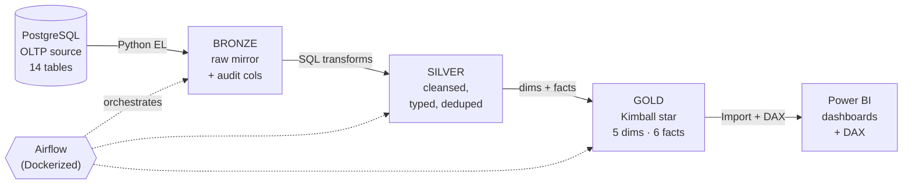
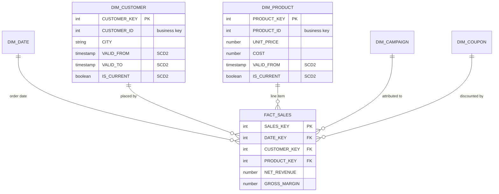

# Ecommerce Data Platform — Modern Data Stack (Postgres → Snowflake → Power BI)

An end-to-end analytics engineering project: a production-style pipeline that ingests an ecommerce OLTP database, transforms it through a medallion architecture into a Kimball dimensional model with SCD Type 2 history, orchestrates the flow with Airflow, and surfaces insights in a Power BI dashboard.

## Architecture



The pipeline runs as a single Airflow DAG:
`bronze_ingestion → silver_transforms → gold_dimensions → gold_facts → gold_views`

## Tech stack

| Layer | Technology |
|---|---|
| Source | PostgreSQL (OLTP) |
| Ingestion | Python, pandas, SQLAlchemy, snowflake-connector |
| Warehouse | Snowflake (Bronze / Silver / Gold schemas) |
| Transformation | SQL (medallion), SCD Type 2 logic |
| Orchestration | Apache Airflow (Docker, LocalExecutor) |
| BI | Power BI Desktop (Import mode, DAX) |
| Environment | WSL2 / Ubuntu, Docker Desktop |

## Dimensional model



### Bus matrix

| Fact (grain)              | DIM_DATE | DIM_CUSTOMER | DIM_PRODUCT | DIM_CAMPAIGN | DIM_COUPON |
|---------------------------|:---:|:---:|:---:|:---:|:---:|
| FACT_SALES (order line)   | ✓ | ✓ | ✓ | ✓ | ✓ |
| FACT_PAYMENTS (payment)   | ✓ | ✓ | — | — | — |
| FACT_SHIPMENTS (shipment) | ✓ | ✓ | — | — | — |
| FACT_RETURNS (line)       | ✓ | ✓ | ✓ | — | — |
| FACT_REVIEWS (review)     | ✓ | ✓ | ✓ | — | — |
| FACT_WEB_SESSIONS         | ✓ | ✓* | — | ✓ | — |

\* nullable — guest sessions route to the unknown-member row.

## Technical highlights

- **SCD Type 2 dimensions** (DIM_CUSTOMER, DIM_PRODUCT) with surrogate keys, effective-dating (VALID_FROM/VALID_TO/IS_CURRENT), and MD5 row-hash change detection. Facts join to the dimension version that was current at the transaction date (point-in-time join), so historical margin stays correct even after a product is repriced.
- **Medallion architecture** with full lineage: every row carries audit columns; every pipeline run is logged (see `GOLD.VW_PIPELINE_RUNS`).
- **Idempotent, re-runnable** at every stage — full-refresh Bronze, hash-compared Type 2 dims, MERGE-upsert Type 1 dims.
- **Role-based access control** in Snowflake: a least-privilege service role (ECOM_ENGINEER) owns all objects; ACCOUNTADMIN is reserved for account ops only.
- **Fail-loud task functions**: every transformation raises on empty work discovery or per-item failures, so silent no-ops never masquerade as success.
- **Data quality**: business-rule validation in Silver, orphan-key routing to unknown members (0% orphans on required keys), reconciliation scripts at each layer boundary.

## Running the pipeline

```bash
# 1. Environment
python3 -m venv .venv && source .venv/bin/activate
pip install -r requirements.txt
cp .env.example .env          # fill in Postgres + Snowflake credentials

# 2. Run end-to-end locally
python -m src.ingestion.run_bronze
python -m src.transformations.run_silver
python -m src.transformations.run_gold_dims
python -m src.transformations.run_gold_facts
python -m src.transformations.gold_views

# 3. Or orchestrate with Airflow
cd docker/airflow
docker compose build
docker compose up airflow-init
docker compose up -d           # UI at http://localhost:8080
```

## Repository structure

```
ecommerce-data-platform/
├── src/
│   ├── ingestion/        # Bronze: Postgres -> Snowflake
│   ├── transformations/  # Silver + Gold orchestrators
│   └── utils/            # DB connections
├── sql/ddl/
│   ├── silver/           # cleansing transforms (14 files)
│   └── gold/             # dims, facts, views
├── docker/airflow/       # Dockerized Airflow (DAG, compose, image)
├── powerbi/              # dashboard screenshots
├── requirements.txt
├── .env.example
└── README.md
```

## Possible extensions

- Incremental ingestion (CDC / high-water-mark) instead of full refresh
- dbt for transformation management and tests
- CI/CD with GitHub Actions
- Great Expectations / dbt tests for automated data quality gates

## License

MIT — see [LICENSE](LICENSE).